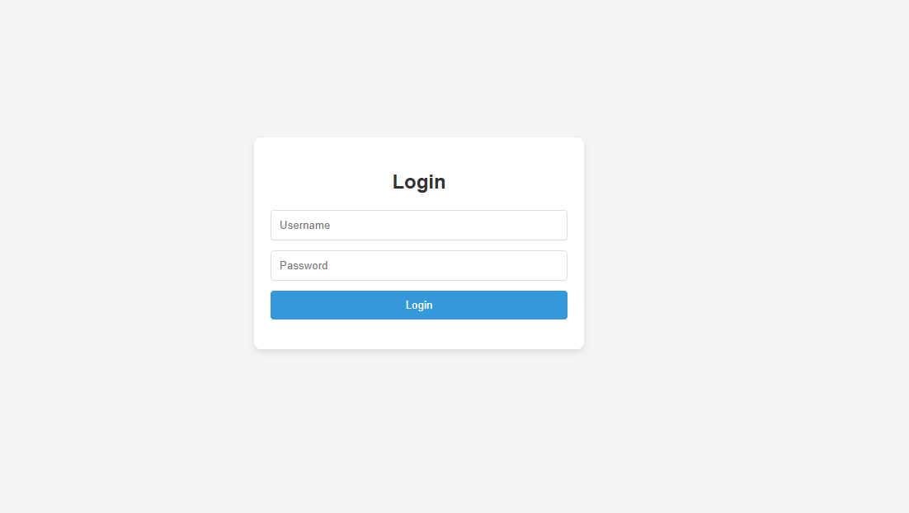
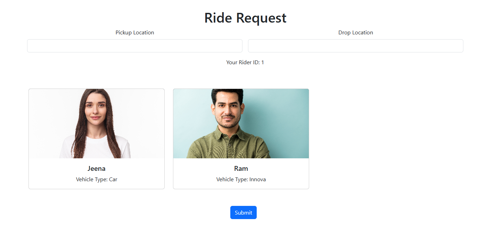

# Basic Ride Sharing API

## 🚗 Overview
This project is a **Ride Sharing API** built with **Django Rest Framework (DRF)**, utilizing class-based viewsets to manage users, rides, and ride status updates.

## HTML page for rider

Login for Riders to add request



After successfull login it will navugate to request form



## 📌 Features

### 🏷 User API
- User registration and login functionality using Django Rest Framework's authentication.

### 🚖 Ride API
Ride Model includes the following fields:
- `rider` (ForeignKey to `RiderUserTbl`)
- `driver` (ForeignKey to `DriverUserTbl`, nullable)
- `pickup_location` (CharField)
- `dropoff_location` (CharField)
- `status` (Choices: Pending, Accepted, In Progress, Completed, Cancelled)
- `created_at` (DateTimeField)
- `updated_at` (DateTimeField)

#### API Endpoints:
- Create a Ride Request
- View Ride Details
- List All Rides

### 🔄 Ride Status Updates
API endpoints to update ride status when:
- Ride is started
- Ride is completed
- Ride is cancelled

## 🎯 Bonus Features

### 🚘 Ride Matching (Bonus for Juniors)
- Algorithm to match ride requests with available drivers based on proximity or other factors.
- API endpoint for drivers to accept a ride request.

### ✅ Basic Testing (Bonus for Juniors)
- Basic Django tests for models and API endpoints.


## 🚀 Getting Started

### 📌 Installation
1. Clone the repository:
   ```bash
   git clone https://github.com/PriyankaTaug/RideSharingAPI.git
   ```
2. Create a virtual environment and install dependencies:
   ```bash
   python3 -m venv venv
   source venv/bin/activate  # On Windows use: venv\Scripts\activate
   pip install -r requirements.txt
   ```
3. Run migrations:
   ```bash
   python manage.py migrate
   ```
4. Run the development server:
   ```bash
   python manage.py runserver
   ```
